# Creating container inside docker and performing task

1\. Create container image that’s has Jenkins installed using dockerfile

2\. When we launch this image, it should automatically starts Jenkins
service in the container.

3\. Create a job chain of job1, job2, job3 and job4 using build pipeline
plugin in Jenkins

4\. Job1 : Pull the Github repo automatically when some developers push
repo to Github.

5\. Job2 : By looking at the code or program file, Jenkins should
automatically start the respective language interpreter install image
container to deploy code ( eg. If code is of PHP, then Jenkins should
start the container that has PHP already installed ).

6\. Job3 : Test your app if it is working or not.

7\. Job4 : if app is not working , then send email to developer with
error messages.

8\. Create One extra job job5 for monitor : If container where app is
running. fails due to any reason then this job should automatically
start the container again.

# Solution:

## Create container image that’s has Jenkins installed using dockerfile

Step 1: Create dockerfile that pulls centos from dockerhub and install
Jenkins in it.

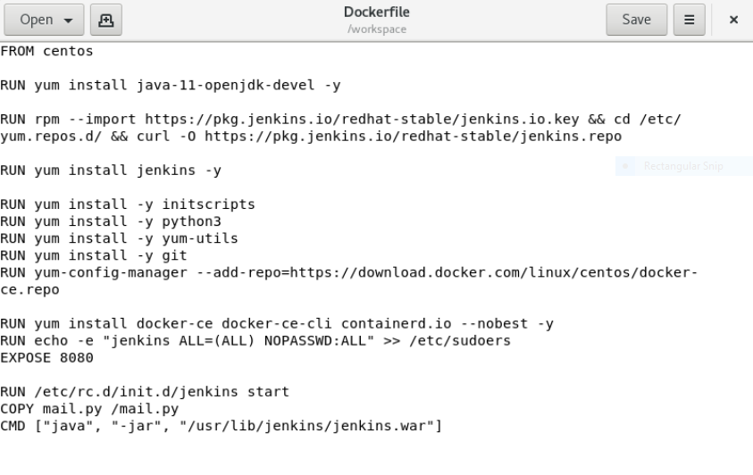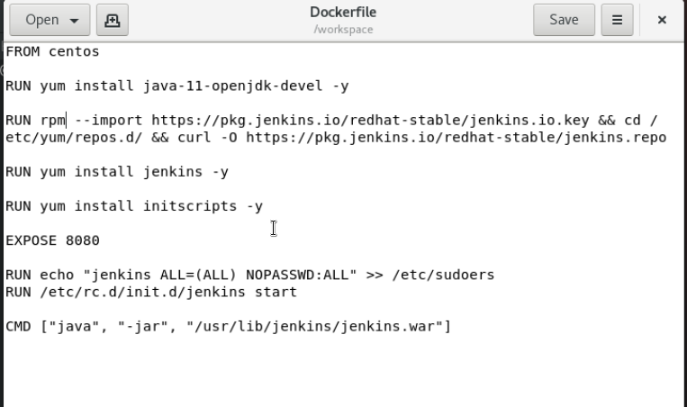

FROM : image to be used in container

RUN: commands to run to modify the image

CMD: the cmd used here will keep the Jenkins live till the container is
on.

Expose: instructs the docker that the container listens at specific
port.

STEP 2:

BUILD the docker file using docker build –t name:tag .

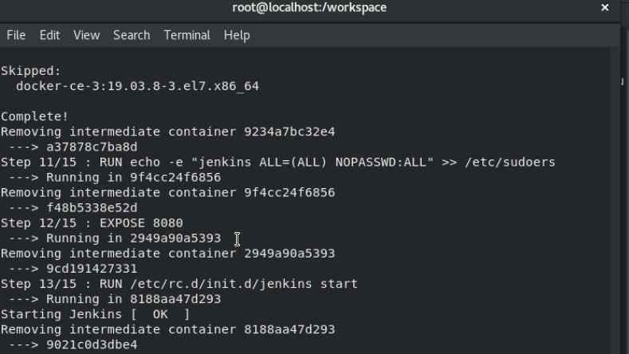

STEP 3:

Run the container by :

Docker run –dit --name os2 –v jenklins\_storage:/root/.jenkins –P
docker-jenkins:v1

STEP 4:

Open the url at the browser using 0.0.0.0:portnumber

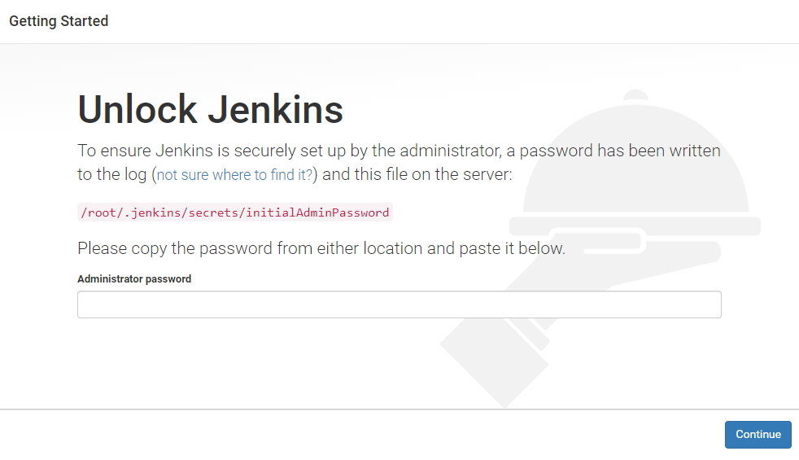

Jenkins has been SUCESSFULLY installed inside a container.

## Create a job chain of job1, job2, job3 and job4 using build pipeline plugin in Jenkins

CREATING JOB 1:

Pull the Github repo automatically when some developers push repo to
Github.

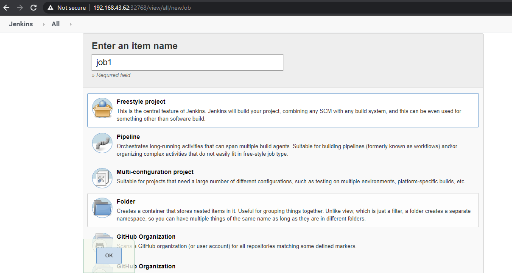

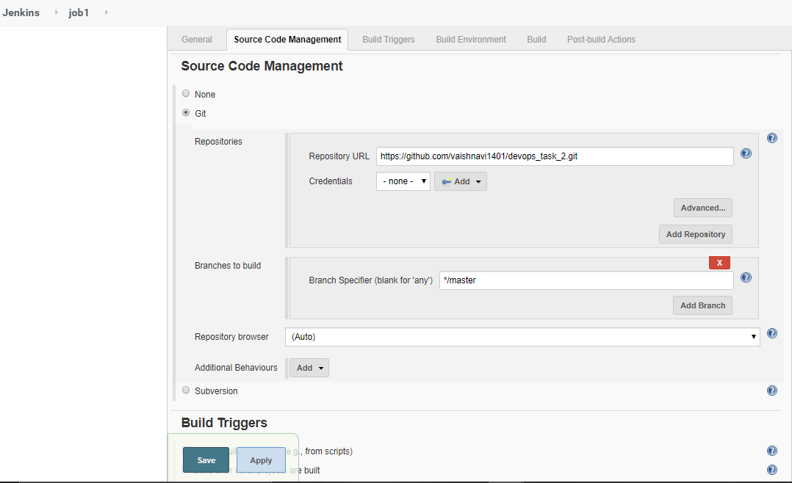

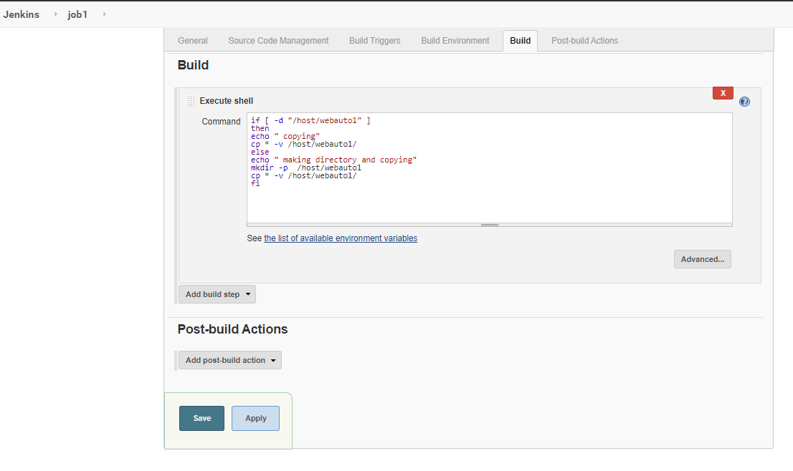

Creating job 2:

This job will trigger with job 1

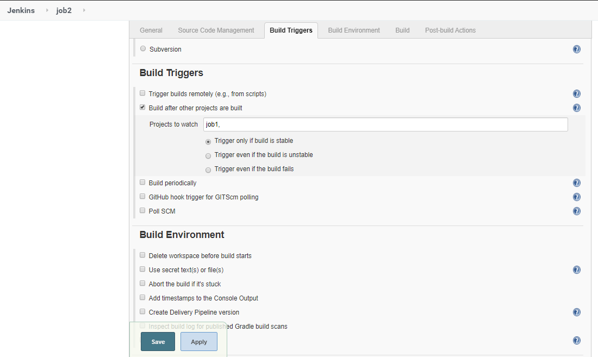

Then it will detect the type of file and will launch a container
according to it

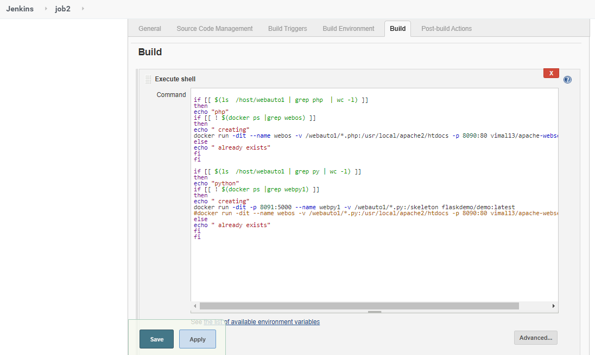

Creating job 3:

Testing your applications if it is working or not. And triggering with
job 2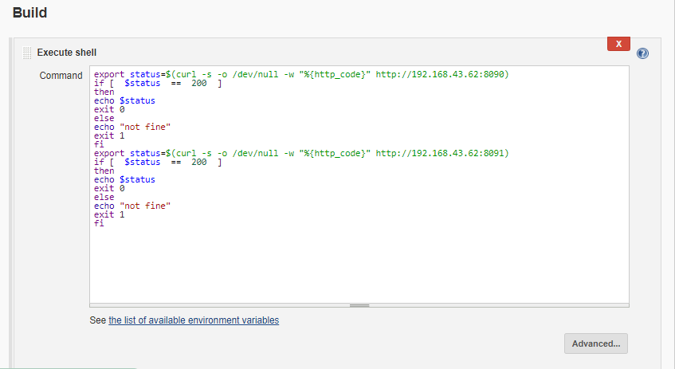

Creating job 4:

We will be sending mail to the user if any job is not working

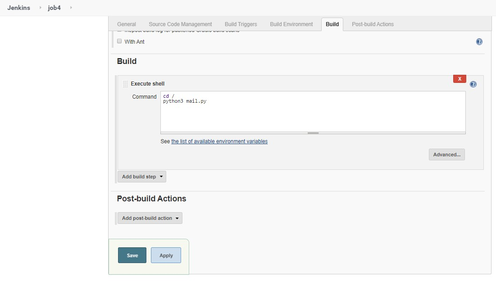

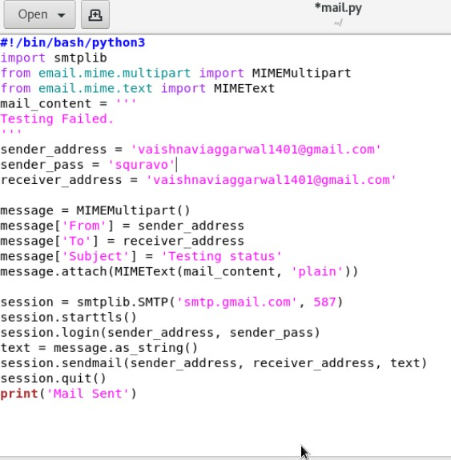

Creating job 5:

job5 for monitor : If container where app is running. fails due to any
reason then this job should automatically start the container again.

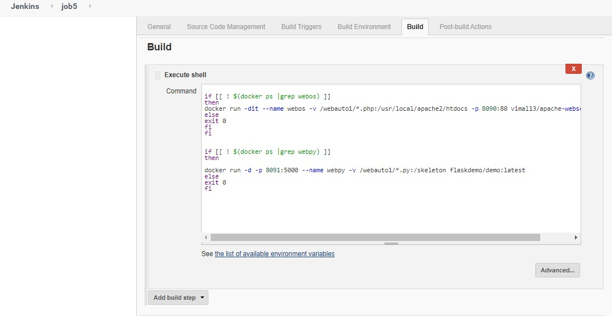
